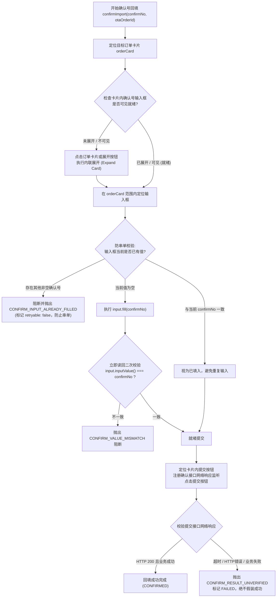

# 美团订单采集、详情抓取与确认号回填技术方案 (Meituan Order Guardian Architecture Specification)

> **版本**：2.1.0 (Production Architecture Baseline - Post-Review Refined)  
> **适用范围**：美团待处理订单采集 (`OTA_COLLECT_ORDER`)、详情抓取与中台入单 (`OTA_IMPORT_ORDER`)、确认号回填 (`OTA_CONFIRM_IMPORT`)、渠道风控熔断与状态同步  
> **核心原则**：Electron-Only、Fail-Fast（权威网络响应为唯一数据源，零 DOM 业务数据拼接）、KISS 原则（高内聚 3 核心模块）、单一可信日志源、订单卡片内联流式交互、零技术暴露  

---

## 1. 系统定位与核心设计原则

### 1.1 系统定位
本方案是 Smart Link 订单守护系统中美团渠道的核心执行链路。系统在 Electron 桌面端主进程中通过 Playwright 驱动美团商家中心后台（E-booking），实现待处理订单的自动化采集、同页详情提取、中台入单编排与确认号回填。

### 1.2 核心设计原则

1. **权威网络响应为唯一数据源 (Network Authority & Zero DOM Data Extraction)**：
   - 订单列表数据与订单详情数据**必须 100% 来源于美团后台网络请求（JSON 响应）**；
   - DOM 仅用于定位交互控件（Tab、刷新按钮、订单卡片、输入框、提交按钮）以及断言状态就绪（元素可见性、无风控遮罩）；
   - **严禁从 DOM 拼接或提取任何业务数据**（如入住人、房型、日期、金额等），坚决废除脆弱的 DOM 文本爬虫与模糊“多路融合”逻辑；
   - 网络接口超时、非 200 状态码、业务返回失败或核心字段缺失时，系统立即阻断并抛出确定错误码（Fail-Fast）。

2. **KISS 原则与扁平模块化 (KISS & Minimal Abstraction)**：
   - 杜绝过度设计与类爆炸，美团渠道核心逻辑高度收敛为 **3 个核心模块**：
     - `meituanDutyContracts.ts`：契约层（错误码枚举、轻量任务回执与 `DutyExecutionError` 结构化异常类）；
     - `meituanOrderParsers.ts`：纯函数层（列表、详情、敏感解密响应的清洗解析，100% 独立单测覆盖）；
     - `meituanDutyRunner.ts`：执行层（实现标准 `ChannelDutyRunner`，持有 `Page` 单实例，任务互斥锁，驱动页面交互）。
   - 彻底废除多层嵌套的 `Evidence` 装箱模型与冗余的 `bodySha256` 计算；剔除未使用的面态枚举等无意义定义。

3. **订单卡片内联流式交互 (Card Inline Expand & Flow Layout)**：
   - 美团后台订单展示结构为流式排布的**订单卡片（Order Card）/ 列表行（Order Row）**，绝非模态弹窗（Modal Dialog）；
   - 详情查看采用**卡片内联展开 (Card Inline Expand)**，展开后不产生模态遮罩，不阻断全局页面事件；
   - 确认号输入框与提交按钮天然位于订单卡片内部，回填直接在目标卡片作用域内执行；
   - 废除弹窗关闭、Escape 快捷键与弹窗 detached 断言等脱离实际的伪逻辑。

4. **请求合并门禁与 3 秒防抖等待补偿 (Coalesced Debounce & Wait Compensation)**：
   - 针对美团后台接口的高频调用频控，列表刷新引入在途请求合并（In-flight Promise Coalescing）与 3 秒防抖时间戳保护；
   - **请求合并门禁位于获取锁之前**：若当前已有正在进行中的刷新 Promise，直接复用其返回结果，避免并发请求进入锁排队击穿；
   - 若调度引擎在防抖窗口内触发采集，系统通过拟真等待补齐剩余时间后再触发刷新，**严禁直接返回空数组**，从源头防止将真实订单误报为 `VERIFIED_EMPTY`。

5. **智能跳过电话解密 (Smart Skip Phone Privacy)**：
   - 美团在点击“查看姓名”解密时，接口报文通常已同步返回真实手机号；
   - 若原始详情或姓名解密响应中已存在明文手机号，**强制跳过点击“查看电话”控件**，彻底规避 1 秒内连续发起双重敏感解密的极高危风控探针。

6. **全链路错误码与 `retryable` 贯穿透传 (End-to-End Retryable Propagation)**：
   - 底层 Runner 抛出带有确定 `errorCode` 与 `retryable: false` 的结构化异常 `DutyExecutionError`；
   - 通用编排层 `dutyTaskDispatcher.ts` 捕获异常时，提取并透传 `errorCode` 与 `retryable`；
   - 调度引擎 `dutyOrchestrationEngine.ts` 第 743 行优先透传 `execRes.retryable` 上报中台，形成完整的不可重试闭环，杜绝中台盲目反复推单，同时保持其他渠道既有重试机制不受影响。

7. **去技术暴露与边缘触发 Toast 门禁 (Edge-Triggered Toast & Zero Technical Leakage)**：
   - 废除日志流嗅探 Toast 反模式；
   - 渲染进程通过**边缘触发机制 (Edge-triggered)** 监听渠道状态跃迁，仅在状态由非 `DEGRADED` 变为 `DEGRADED` 或收到不可重试终态失败时触发单次 Toast，杜绝轮询过程中的弹窗轰炸；
   - 提示文案严格遵循人文关怀语言，严禁向终端用户展示 URL、HTTP 状态码、JSON 字段或 DOM 选择器。

---

## 2. 总体架构与模块划分

### 2.1 模块分层架构

```
src/crawler/duty/
├── meituanDutyContracts.ts      # 契约层：错误码枚举、DutyExecutionError 结构化异常类、任务回执
├── meituanOrderParsers.ts        # 纯函数层：列表/详情/敏感解密响应的纯函数解析器 (100% 单测)
└── meituanDutyRunner.ts          # 执行层：实现 ChannelDutyRunner，持有 Page，带互斥锁，驱动交互

src/crawler/duty/ (通用协同模块)
├── dutyContracts.ts             # 通用契约：补充 retryable?: boolean 属性
├── dutyTaskDispatcher.ts        # 通用编排：中台入单、模板拉取、备注渲染、异常 errorCode/retryable 透传
└── dutyOrchestrationEngine.ts   # 调度引擎：认领任务、上报结果、第 743 行优先透传 retryable

src/store/slices/
├── appSlice.ts                  # 基础状态：ToastOptions.type 扩充支持 'warning'
└── orderGuardianSlice.ts        # 业务状态：边缘触发监听渠道状态、终态失败显式 Toast 门禁
```

### 2.2 模块职责矩阵

| 文件路径 | 分层定位 | 职责边界 |
| :--- | :--- | :--- |
| `src/crawler/duty/meituanDutyContracts.ts` | 领域契约 | 集中定义美团核心错误码枚举 `MeituanDutyErrorCode`、结构化异常类 `DutyExecutionError` 与轻量任务回执类型。杜绝过度装箱与未使用的冗余定义。 |
| `src/crawler/duty/meituanOrderParsers.ts` | 纯函数计算 | 负责对美团列表接口、详情接口、敏感数据接口的 JSON 响应进行强类型校验、字段提取与清洗。不依赖任何 DOM 或 Playwright API。 |
| `src/crawler/duty/meituanDutyRunner.ts` | 渠道自动化执行 | 实现标准 `ChannelDutyRunner` 接口。持有当前渠道的 Playwright `Page` 实例；通过**任务互斥锁 (Task Mutex Lock)** 保证单页面交互串行化；负责带防抖等待的列表刷新、目标卡片内联展开、网络响应拦截、敏感数据智能解密、卡片内确认号回填。抛出确定性的 `DutyExecutionError`。 |
| `src/crawler/duty/dutyContracts.ts` | 通用契约 | 在 `DutyTaskExecutionResult` 接口中补充 `retryable?: boolean` 字段。 |
| `src/crawler/duty/dutyTaskDispatcher.ts` | 通用编排调度 | 调度各渠道 Runner 获取数据；执行字段校验（Fail-Fast）；调用中台 API；调度卡片温和收起；**在捕获 Runner 异常时，解构并透传底层抛出的 `errorCode` 与 `retryable` 至 `DutyTaskExecutionResult`**。 |
| `src/crawler/duty/dutyOrchestrationEngine.ts` | 调度引擎 | 负责任务认领与中台结果上报；在第 743 行优先透传 `execRes.retryable`。 |
| `src/store/slices/appSlice.ts` | 全局状态 | Toast Payload 的 `type` 扩充支持 `'warning'`，以契合风控告警语义。 |
| `src/store/slices/orderGuardianSlice.ts` | 表现与状态 | 接收渠道状态与失败信息，采用**边缘触发机制**在渠道降级或不可恢复终态失败时显式触发用户友好的 Toast 提示。 |

### 2.3 核心数据流向图

```mermaid
flowchart TD
    subgraph Engine["主进程任务调度引擎 (dutyOrchestrationEngine.ts)"]
      E1["从中台认领任务 (GET /tasks/claim)"] --> E2["调用 dispatchDutyTask(task, runner)"]
      E3["向中台报告任务结果 (PUT /tasks/id/result)"] <-- E2
    end

    subgraph Dispatcher["通用任务编排层 (dutyTaskDispatcher.ts)"]
      D1["分发任务类型"]
      D2["OTA_COLLECT_ORDER -> runner.collectUnhandledOrders()"]
      D3["OTA_IMPORT_ORDER -> runner.inspectOrderDetail(orderId)"]
      D4["对齐统一协议 -> 拉取模板 -> 渲染备注 -> 调用中台 importToolkitOrder"]
      D5["调度卡片收起 -> runner.closeOrderDetail()"]
      D6["OTA_CONFIRM_IMPORT -> runner.confirmImport(confirmNo, orderId)"]
      D7["捕获异常: 提取 err.errorCode 与 err.retryable 完整透传"]
      
      D1 --> D2
      D1 --> D3
      D3 --> D4 --> D5
      D1 --> D6
      D2 -.->|异常| D7
      D3 -.->|异常| D7
      D6 -.->|异常| D7
      D7 --> E3
    end

    subgraph MeituanRunner["美团核心执行器 (meituanDutyRunner.ts)"]
      R_Gate["在途请求合并门禁 (In-flight Coalescing & Debounce)"]
      R0["任务互斥锁 (Task Mutex Lock)"]
      R1["列表采集: 交互点击Tab -> 拦截列表响应"]
      R2["详情抓取: 定位订单卡片 -> 内联展开 -> 拦截详情响应 -> 智能解密"]
      R3["确认回填: 定位订单卡片 -> 卡片内回填校验 -> 提交 -> 拦截确认响应"]
      R4["卡片收起: 温和点击收起按钮 (无阻断)"]
      
      R_Gate --> R0
      R0 --> R1
      R0 --> R2
      R0 --> R3
      R0 --> R4
    end

    subgraph Parsers["纯函数解析层 (meituanOrderParsers.ts)"]
      P1["parseMeituanOrderListResponse() -> 提取待处理订单概要"]
      P2["parseMeituanOrderDetailResponse() -> 提取详情字段"]
      P3["parseMeituanSensitiveResponse() -> 提取真实姓名与手机号"]
    end

    R1 -->|拦截 JSON| P1
    R2 -->|拦截 JSON| P2
    R2 -->|拦截 JSON| P3
    E2 --> D1
    D2 --> R_Gate
    D3 --> R0
    D5 --> R4
    D6 --> R0
```

---

## 3. 核心执行链路设计

### 3.1 待处理订单列表采集 (`OTA_COLLECT_ORDER`)

#### 执行流程
1. **在途请求合并门禁 (In-flight Coalescing & Debounce)**：
   - 检查当前是否存在正在执行的列表采集 Promise (`inFlightListPromise`)；若存在，直接 `await inFlightListPromise` 并返回其结果，避免并发请求进入锁排队击穿；
   - 读取上次成功触发刷新的时间戳 `lastListRefreshTime`；
   - 若 `Date.now() - lastListRefreshTime < 3000`：计算剩余延迟 `remainMs = 3000 - elapsed`，调用 `await humanDelay(page, remainMs, remainMs + 200)` 等待补齐，然后再发起交互；
2. **获取任务互斥锁 (Task Mutex Lock)**：
   - 仅真正需要发起页面交互的执行流竞争获取互斥锁，确保单页面操作串行化；
   - 将当前执行流程封装赋值给 `inFlightListPromise`，并在 `finally` 中清空；
3. **前置风控与页面预检**：
   - 检查页面是否存在人机验证码、滑块或 Yoda 风控遮罩；若命中，抛出 `DutyExecutionError('...', RISK_VERIFICATION_REQUIRED, false)`；
   - 校验当前页面 URL 是否属于美团订单中心；若不匹配，抛出 `DutyExecutionError('...', TARGET_PAGE_NOT_READY, false)`；
4. **注册单次网络响应监听**：
   - 使用 `page.waitForResponse()` 监听符合美团列表特征的 URL（如 `/orders/task/list`、`/orders/list`、`/orders/unhandled` 等），设定超时时间为 8000ms；
5. **触发交互刷新**：
   - 优先定位并点击「待确认订单」/「待确认」Tab 按钮；
   - 若 Tab 不可见，寻找页面上的「查询」/「搜索」/「刷新」按钮点击；
   - 若均不可见，抛出 `DutyExecutionError('...', LIST_TRIGGER_UNAVAILABLE, false)`；
   - 记录最新刷新时间戳 `lastListRefreshTime = Date.now()`；
6. **响应解析与 Fail-Fast**：
   - 等待列表网络响应到达：
     - 若超时未收到响应，抛出 `DutyExecutionError('...', LIST_RESPONSE_TIMEOUT, true)`；
     - 若 HTTP 状态码非 200，抛出 `DutyExecutionError('...', LIST_HTTP_ERROR, true)`；
     - 将响应文本交付纯函数 `parseMeituanOrderListResponse` 解析：
       - 若业务状态码非成功，抛出 `DutyExecutionError('...', LIST_BUSINESS_FAILED, false)`；
       - 若订单数组长度为 0，返回成功结果，状态标记为 `VERIFIED_EMPTY`；
       - 若订单数组长度 > 0，执行去重并规范化，返回成功结果，状态标记为 `FOUND`。

---

### 3.2 订单详情抓取与中台入单 (`OTA_IMPORT_ORDER`)

#### 执行流程
1. **获取任务互斥锁**；
2. **前置风控嗅探**：若页面存在风控特征，抛出 `DutyExecutionError('...', RISK_VERIFICATION_REQUIRED, false)`；
3. **定位目标订单卡片 (`orderCard`)**：
   - 在页面中定位包含 `otaOrderId` 的订单卡片容器元素；
   - 若超时 2000ms 未找到，抛出 `DutyExecutionError('...', ORDER_CARD_NOT_FOUND, false)`（不可重试）；
4. **注册单次详情网络响应监听**：
   - 监听匹配该 `otaOrderId` 的详情接口响应（如 `/api/v1/ebooking/orders/`、`/orders/detail` 等），设定超时时间为 8000ms；
5. **触发卡片内联展开 (Inline Expand)**：
   - 检查卡片是否已展开；若未展开，点击卡片上的“详情”、“查看”按钮或直接点击卡片主体触发展开；
6. **权威详情响应解析**：
   - 等待详情网络响应到达：
     - 若超时未收到响应，抛出 `DutyExecutionError('...', ORDER_DETAIL_TIMEOUT, true)`；
     - 若 HTTP 状态码非 200，抛出 `DutyExecutionError('...', ORDER_DETAIL_HTTP_ERROR, true)`；
     - 交付纯函数 `parseMeituanOrderDetailResponse` 解析出关键字段（房型、入离日期、金额、间数等）；
     - **Fail-Fast 核心校验**：若入离日期、房型等关键字段缺失，立即抛出 `DutyExecutionError('...', ORDER_DETAIL_FIELD_MISSING, false)` 阻断流程；
7. **处理敏感客人数据 (智能跳过电话解密)**：
   - **姓名解密**：
     - 若详情响应中姓名已是明文，直接使用；
     - 若姓名处于脱敏状态，在当前卡片内寻找“查看姓名”/“获取姓名”按钮；
     - 注册敏感数据接口响应监听（`/sensitiveData`、`/confirmPhone`），点击按钮；
     - 若出现平台二次确认弹窗（如“我已知晓”、“确定”），点击确认；
     - 解析敏感数据响应获取真实姓名；若解密失败抛出 `DutyExecutionError('...', GUEST_NAME_DECRYPT_FAILED, false)`；
   - **智能跳过电话解密 (Smart Skip Phone Privacy)**：
     - 检查上述解密响应或原始详情中是否已获取到真实明文手机号；
     - 若已存在明文手机号，**强制跳过点击“查看电话”按钮**，杜绝 1 秒内连续发起双重敏感解密的高危行为；
     - 仅当手机号仍脱敏且中台有明确需要时，才在安全间隔后受控尝试单次解密；若电话按钮缺失或解密失败，记录日志，不阻断入单（中台允许手机号脱敏）；
8. **组装并交付编排层**：
   - 将强类型 `ExtractedOrderDetail` 返回给 `dutyTaskDispatcher.ts`；
   - Dispatcher 执行统一订单协议规范化（`alignOrderToProtocol`）；
   - 拉取远端渠道备注模板（`fetchChannelRemarkTemplate`）并渲染备注（`renderRemarkFromProtocol`）；
   - 转换为中台入单请求载荷（`buildImportPayloadFromProtocol`）；
   - 调用统一中台入单接口（`importToolkitOrder`）并记录审计日志；
9. **收尾温和收起**：
   - 入单完成后（无论成功还是失败），Dispatcher 调度 `runner.closeOrderDetail()`；
   - 执行器尝试点击当前卡片上的“收起”按钮；若卡片无收起按钮或已折叠，直接返回，不影响后续流转。

---

### 3.3 确认号回填 (`OTA_CONFIRM_IMPORT`)

#### 执行流程图



#### 关键约束
1. **入参严格校验**：`confirmNo` 必须为非空字符串（长度 1~64，无控制字符），`otaOrderId` 必须为非空字符串；
2. **防串单严格校验**：读取输入框现有值，若已存在其他非空确认号，立即抛出 `DutyExecutionError('...', CONFIRM_INPUT_ALREADY_FILLED, false)`，绝对禁止盲目覆盖；
3. **回填后二次读回校验**：执行 `fill` 后必须通过 `inputValue()` 读回比对，确保内容 100% 准确写入；若不一致抛出 `CONFIRM_VALUE_MISMATCH`；
4. **权威网络确认**：提交后必须校验平台确认接口网络响应，HTTP 200 且业务成功码匹配才视为成功；若响应超时或未知，抛出 `CONFIRM_RESULT_UNVERIFIED`，严禁在未获明确回执时假装成功。

---

## 4. 契约定义与数据模型

### 4.1 核心错误码枚举与结构化异常 (`meituanDutyContracts.ts`)

```typescript
export enum MeituanDutyErrorCode {
  // 页面与环境状态
  TARGET_PAGE_NOT_READY = 'TARGET_PAGE_NOT_READY',         // 未处于美团订单中心页面
  RISK_VERIFICATION_REQUIRED = 'RISK_VERIFICATION_REQUIRED', // 命中安全验证/滑块/Yoda风控

  // 列表采集链路
  LIST_TRIGGER_UNAVAILABLE = 'LIST_TRIGGER_UNAVAILABLE',     // 列表刷新按钮/Tab不可用
  LIST_RESPONSE_TIMEOUT = 'LIST_RESPONSE_TIMEOUT',           // 列表网络响应超时
  LIST_HTTP_ERROR = 'LIST_HTTP_ERROR',                       // 列表网络请求返回非200
  LIST_BUSINESS_FAILED = 'LIST_BUSINESS_FAILED',             // 列表接口业务状态码失败

  // 详情抓取链路
  ORDER_CARD_NOT_FOUND = 'ORDER_CARD_NOT_FOUND',             // 列表中未找到目标订单卡片
  ORDER_DETAIL_TIMEOUT = 'ORDER_DETAIL_TIMEOUT',             // 详情网络响应超时
  ORDER_DETAIL_HTTP_ERROR = 'ORDER_DETAIL_HTTP_ERROR',       // 详情网络请求返回非200
  ORDER_DETAIL_FIELD_MISSING = 'ORDER_DETAIL_FIELD_MISSING', // 详情关键业务字段缺失
  GUEST_NAME_DECRYPT_FAILED = 'GUEST_NAME_DECRYPT_FAILED',   // 客人姓名解密失败

  // 确认号回填链路
  CONFIRM_INPUT_NOT_FOUND = 'CONFIRM_INPUT_NOT_FOUND',       // 未找到确认号输入框
  CONFIRM_INPUT_ALREADY_FILLED = 'CONFIRM_INPUT_ALREADY_FILLED', // 输入框已存在不同确认号
  CONFIRM_VALUE_MISMATCH = 'CONFIRM_VALUE_MISMATCH',         // 确认号填入后读回比对不一致
  CONFIRM_SUBMIT_NOT_FOUND = 'CONFIRM_SUBMIT_NOT_FOUND',     // 未找到确认提交按钮
  CONFIRM_RESPONSE_TIMEOUT = 'CONFIRM_RESPONSE_TIMEOUT',     // 确认接口网络响应超时
  CONFIRM_RESULT_UNVERIFIED = 'CONFIRM_RESULT_UNVERIFIED',   // 确认接口返回失败或未通过校验
}

/**
 * 结构化执行异常，支持精准透传错误码与重试属性
 */
export class DutyExecutionError extends Error {
  public readonly errorCode: string;
  public readonly retryable?: boolean;

  constructor(message: string, errorCode: string, retryable?: boolean) {
    super(message);
    this.name = 'DutyExecutionError';
    this.errorCode = errorCode;
    this.retryable = retryable;
  }
}
```

### 4.2 列表采集结果模型

```typescript
/** 列表采集结构化结果 */
export interface MeituanOrderCollectionResult {
  otaChannelCode: 'MEITUAN';
  collectionStatus: 'VERIFIED_EMPTY' | 'FOUND';
  recordCount: number;
  orders: DutyUnhandledOrderSummary[];
}
```

### 4.3 通用契约补全 (`src/crawler/duty/dutyContracts.ts`)

```typescript
export interface DutyTaskExecutionResult {
  status: 'SUCCEEDED' | 'FAILED';
  result?: Record<string, unknown>;
  errorCode?: string;
  errorMessage?: string;
  retryable?: boolean; // 底层执行器显式声明失败是否可重试
}
```

---

## 5. 重试策略与调度引擎协同

### 5.1 通用编排层与调度引擎透传闭环

#### ① `dutyTaskDispatcher.ts` 异常解构与透传
重构 `src/crawler/duty/dutyTaskDispatcher.ts` 中的异常捕获逻辑，避免硬编码抹除错误码：

```typescript
// src/crawler/duty/dutyTaskDispatcher.ts 异常透传范式
catch (err) {
  const errMsg = err instanceof Error ? err.message : String(err);
  const isRisk = isRiskControlError(err);
  const customCode = (err as { errorCode?: string })?.errorCode;
  const customRetryable = (err as { retryable?: boolean })?.retryable;

  return {
    status: 'FAILED',
    errorCode: isRisk ? 'RISK_VERIFICATION_REQUIRED' : (customCode || 'ORDER_DETAIL_FETCH_FAILED'),
    errorMessage: errMsg,
    retryable: typeof customRetryable === 'boolean' ? customRetryable : (isRisk ? false : undefined),
  };
}
```

#### ② `dutyOrchestrationEngine.ts` 第 743 行向后兼容透传
在主进程任务调度引擎中，中台结果上报载荷 (`resultPayload`) 的 `retryable` 计算做最小向后兼容修改：

```typescript
// src/crawler/duty/dutyOrchestrationEngine.ts 第 743 行
const isRiskIntercepted = execRes.errorCode === 'RISK_VERIFICATION_REQUIRED';
const wireStatus: DutyTaskWireStatus = isSuccess ? 'SUCCESS' : 'FAIL';

const resultPayload = buildTaskResultPayload(task, identity.stationId, {
  status: wireStatus,
  confirmationNo,
  result: execRes.result,
  errorCode: execRes.errorCode || (isSuccess ? undefined : 'TASK_EXECUTION_FAILED'),
  errorMessage: execRes.errorMessage,
  // 优先透传底层执行器显式指定的 retryable；若未指定，沿用原逻辑（风控不可重试，其余默认可重试）
  retryable: isSuccess
    ? undefined
    : (typeof execRes.retryable === 'boolean'
        ? execRes.retryable
        : (isRiskIntercepted ? false : true)),
});
```

### 5.2 业务失败不可重试性判定矩阵

| 场景 / 错误码 | 是否可重试 (`retryable`) | 业务依据与流转处理 |
| :--- | :---: | :--- |
| `RISK_VERIFICATION_REQUIRED` | **false** | 命中人机风控，机器重试只会加剧封禁；渠道置为 `DEGRADED`，通知人工介入 |
| `ORDER_CARD_NOT_FOUND` | **false** | 列表中不存在该订单，订单可能已被取消或处理，重试无意义，直接标记不可重试 |
| `CONFIRM_INPUT_ALREADY_FILLED` | **false** | 输入框已有其他确认号，存在串单风险，禁止机器反复重推覆盖，人工核对 |
| `ORDER_DETAIL_FIELD_MISSING` | **false** | 美团后台返回报文确实缺少必须业务字段，属于数据协议异常，通知人工核对 |
| `LIST_RESPONSE_TIMEOUT` | **true** (默认) | 网络抖动或接口慢，允许调度引擎按既有策略重试 |
| `ORDER_DETAIL_TIMEOUT` | **true** (默认) | 临时网络超时，允许调度引擎按既有策略重试 |
| `CONFIRM_RESPONSE_TIMEOUT` | **true** (默认) | 网络瞬态超时，允许中台重新下发确认 |

---

## 6. 风控熔断与状态同步机制

### 6.1 风控状态模型与流转

风控状态复用既有系统模型中的 `DEGRADED` 渠道状态：

```typescript
export interface ChannelDutyInfo {
  channelCode: string;
  status: 'IDLE' | 'RUNNING' | 'DEGRADED' | 'STOPPED';
  lastStartedAt?: number;
  error?: string;
  manualVerificationRequired?: boolean;
  manualVerificationReason?: string;
}
```

1. **风控探测熔断**：
   - 页面任意环节检测到验证码、滑块或 Yoda 特征时，立即抛出 `DutyExecutionError('...', RISK_VERIFICATION_REQUIRED, false)`；
   - 调度引擎将美团渠道状态置为 `DEGRADED`，`manualVerificationRequired = true`，并停止后续自动化点击任务；
2. **保持会话与窗口可见**：
   - 保持 Playwright 浏览器窗口处于开启与前台激活状态，绝不自动关闭窗口，供操作人员进行人工验证；
3. **人工验证后恢复**：
   - 用户在浏览器窗口中完成滑动或验证后，在桌面控制台点击“已完成验证，继续值守”；
   - 系统执行一次页面无风控复检，复检通过后清除 `DEGRADED` 状态，恢复为 `RUNNING` 正常轮询。

---

## 7. UI 与显式 Toast 通知工程规范

### 7.1 跨进程通信与边缘触发 Toast 门禁

- **严格遵守进程边界**：
  - 主进程（执行器、编排层、调度引擎）严禁直接调用 Redux `dispatch`；
  - 废除任何基于 Redux 日志流监听的 Toast 嗅探中间件。
- **Toast 触发门禁 (Gated Toast)**：
  - **严禁在瞬态重试时弹出 Toast**：对于网络瞬态超时（`LIST_RESPONSE_TIMEOUT`、`ORDER_DETAIL_TIMEOUT` 等），系统仍在自动重试阶段，严禁向用户弹窗“已停止导入”，防止造成弹窗轰炸和恐慌；
  - **仅在终态或需人工介入时触发**：
    1. **边缘触发 (Edge-triggered)**：在 `orderGuardianSlice.ts` 中引入状态前值比对（如 `previousStatus !== 'DEGRADED' && nextStatus === 'DEGRADED'`），确保仅在状态跃迁的边缘单次触发 Toast，轮询维持态严禁重复弹窗；
    2. 任务执行返回且 `retryable === false`（终态不可恢复失败）时，触发错误 Toast。
- **Toast 类型兼容扩充**：
  - 在 `src/store/slices/appSlice.ts` 中将 Toast `type` 扩充支持 `'warning'`，以匹配告警语义。

### 7.2 用户友好提示映射表 (Zero Technical Leakage)

面向最终一线用户的提示必须彻底消除技术细节，严禁包含 URL、HTTP 码、选择器等：

| 错误码 | Toast 类型 | Toast 标题 | Toast 友好文案 |
| :--- | :---: | :--- | :--- |
| `RISK_VERIFICATION_REQUIRED` | warning | 需要人工处理 | 美团后台出现安全验证，请在浏览器窗口中完成验证后再继续 |
| `TARGET_PAGE_NOT_READY` | error | 当前无法处理订单 | 美团后台未处于待处理订单页，请检查浏览器页面 |
| `ORDER_CARD_NOT_FOUND` | error | 未找到目标订单 | 请核对订单是否已在美团商户后台被人工处理或取消 |
| `CONFIRM_INPUT_ALREADY_FILLED` | error | 确认号已有内容 | 输入框已存在不同确认号，系统已停止自动覆盖以防串单 |
| `ORDER_DETAIL_FIELD_MISSING` | error | 订单信息不完整 | 美团后台返回的订单关键信息缺失，请在商户后台核对 |
| `CONFIRM_RESULT_UNVERIFIED` | error | 确认结果无法核实 | 请在美团商户后台人工核对订单确认状态 |

---

## 8. 分阶段实施计划

### Phase 1：契约与纯函数解析器开发 (Day 1)
1. 创建 `src/crawler/duty/meituanDutyContracts.ts`：定义 `MeituanDutyErrorCode`、`DutyExecutionError` 与回执类型；
2. 在 `src/crawler/duty/dutyContracts.ts` 中为 `DutyTaskExecutionResult` 增加 `retryable?: boolean`；
3. 创建 `src/crawler/duty/meituanOrderParsers.ts`：实现列表、详情与敏感解密纯函数解析器；
4. 编写 `meituanOrderParsers.test.ts`，实现 100% 独立单测覆盖。

### Phase 2：美团核心执行器与互斥锁重构 (Day 2)
1. 重构 `src/crawler/duty/meituanDutyRunner.ts`：
   - 引入在途请求合并门禁 (`inFlightListPromise`) 与任务互斥锁（Mutex）；
   - 实现带 3 秒防抖等待补偿的 `collectUnhandledOrders`；
   - 实现基于订单卡片内联展开的 `inspectOrderDetail`（含智能跳过电话解密）；
   - 实现基于订单卡片作用域的 `confirmImport`（含当前值核对与读回比对）；
   - 实现温和卡片折叠 `closeOrderDetail`。

### Phase 3：调度协同与重试透传闭环 (Day 3)
1. 重构 `src/crawler/duty/dutyTaskDispatcher.ts` 中的异常捕获分支，提取底层 Runner 抛出的 `errorCode` 与 `retryable` 并透传至 `DutyTaskExecutionResult`；
2. 在 `src/crawler/duty/dutyOrchestrationEngine.ts` 第 743 行增加 `retryable` 向后兼容透传。

### Phase 4：UI Toast 门禁与状态集成 (Day 4)
1. 在 `src/store/slices/appSlice.ts` 中将 Toast `type` 联合类型扩充支持 `'warning'`；
2. 在 `src/store/slices/orderGuardianSlice.ts` 中实现边缘触发机制与 Toast 门禁；
3. 清理废弃的临时中间件代码与冗余引用；
4. 补充集成测试用例并执行全量 `npm run lint` 与 `npm test`。

---

## 9. 验收标准与测试矩阵

### 9.1 自动化测试矩阵

| 模块 | 测试文件 | 核心断言内容 |
| :--- | :--- | :--- |
| **纯函数解析** | `meituanOrderParsers.test.ts` | 1. 列表空数据准确返回 `VERIFIED_EMPTY`，非空返回 `FOUND`；<br>2. 详情必需字段缺失准确阻断抛错；<br>3. 敏感数据提取支持明文与脱敏识别；<br>4. 金额单位与时间戳规范化准确无误。 |
| **执行器防抖与合并** | `meituanDutyRunner.test.ts` | 1. 并发请求准确复用在途 `inFlightListPromise`，仅发起一次网络交互；<br>2. 3 秒防抖期内发起采集时执行等待补偿，绝不返回假性空数组。 |
| **卡片内联回填** | `meituanDutyRunner.test.ts` | 1. 断言在目标卡片内精确定位输入框，不跨卡片污染；<br>2. 输入框存在冲突确认号时断言抛出 `CONFIRM_INPUT_ALREADY_FILLED` 并标记 `retryable: false`；<br>3. 模拟读回不一致时断言抛出 `CONFIRM_VALUE_MISMATCH`。 |
| **调度透传闭环** | `dutyOrchestrationEngine.test.ts` | 1. `dutyTaskDispatcher` 准确解构并透传 `errorCode` 与 `retryable`；<br>2. 底层返回 `retryable: false` 时，中台结果上报载荷准确包含 `retryable: false`；<br>3. 其他渠道未指定时，沿用既有默认策略。 |

### 9.2 验收基线
1. **代码洁净度**：`npm run lint` 零错误、零警告，TypeScript 类型编译 100% 通过；
2. **测试覆盖**：所有纯函数与重构模块单元测试 100% 通过，无形式化空断言；
3. **零 DOM 业务数据拼接**：自动化执行过程中若网络中断或接口异常，严格 Fail-Fast 抛错，绝不从 DOM 拼接伪造字段；
4. **零弹窗遮挡假设**：全链路完全基于卡片内联流式交互，无任何弹窗关闭阻断与 `Escape` 快捷键依赖。
