# 订单值守系统业务流程与设计规范 (Order Guardian Design)

> 文档状态：已对齐 Electron-Only 原生桌面架构与统一日志可信源规范
> 适用模块：`src/components/orders/`, `src/store/slices/orderGuardianSlice.ts`, `src/crawler/duty/`

---

## 1. 业务流程与流转契约 (Business Flow)

订单值守（Order Guardian）面向酒店前台与值守运维人员，包含**渠道自动化值守调度**与**文旅中台订单运维**双重视角：

```mermaid
flowchart TD
    subgraph ChannelDutyControl["1. 渠道值守控制与状态流转 (Electron 原生 IPC)"]
      C1["用户点击『开始值守』(MEITUAN / DOUYIN / CTRIP 等)"] --> C2["调用 dutyBridge.startDutyByChannel(channelCode)"]
      C2 -->|"IPC: duty:start"| C3["主进程 DutyOrchestrationEngine 启动渠道 Runner"]
      C3 --> C4["状态流转: STOPPED -> STARTING -> RUNNING"]
      C4 --> C5["启动 60s 周期上报 POST /toolkit/toolbox/actual-state/report\n(若任一渠道 RUNNING，app 为 RUNNING，上报活跃 target 列表)"]
      C6["用户点击『停止值守』"] --> C7["调用 dutyBridge.stopDutyByChannel(channelCode)"]
      C7 -->|"IPC: duty:stop"| C8["主进程停止 Runner -> 恢复 STOPPED 状态"]
      C8 --> C9["所有渠道停止时，立即上报 status=STOP, targets=[]"]

      C3 -.->|"任务日志与调度事件"| LOGS["主进程 publishMainLog -> IPC 'host:log-entry' -> 前端 Redux -> IndexedDB"]
    end

    subgraph OrderMonitoring["2. 文旅订单监控与人工运维 (Client SDK -> 中台 REST)"]
      M1["挂载『订单值守』工作区"] --> M2["并发请求: GET /toolkit/orders/statistics 与 GET /toolkit/orders (首屏)"]
      M2 --> M3["多维筛选: 状态 Tabs (全部/待确认/成功/失败/取消/导入中) + 日期起止 + 搜索框"]
      M3 --> M4["重新拉取对应条件的订单列表"]
      
      M4 --> M5{"点击订单行操作菜单 TableRowActions"}
      M5 -->|"状态为 FAILED"| ACT_FAIL["开放动作: 编辑 (EDIT) / 导入 (IMPORT) / 删除 (DELETE)"]
      M5 -->|"状态为 SUCCESS"| ACT_SUCC["开放动作: 取消 (CANCEL)"]
      M5 -->|"PENDING / IMPORTING / CANCEL"| ACT_DIS["全部禁用并提示状态原因"]

      ACT_FAIL -->|"点击『导入』"| OP_IMP["POST /toolkit/orders/:id/import -> Toast 提示 -> 刷新列表与统计"]
      ACT_FAIL -->|"点击『删除』"| OP_DEL["二次确认 -> DELETE /toolkit/orders/:id -> 刷新列表"]
      ACT_SUCC -->|"点击『取消』"| OP_CAN["二次确认 -> PUT /toolkit/orders/:id/cancel -> 刷新列表"]

      ACT_FAIL -->|"点击『编辑』"| DRAWER["右侧滑出 EditOrderDrawer\n并发拉取订单详情与该酒店产品选项"]
      DRAWER --> EDIT_FORM["修改客人信息/电话，下拉选择文旅房型、房价码、预订类型，动态填写每日价格"]
      EDIT_FORM --> EDIT_SAVE["点击『保存修改』-> PUT /toolkit/orders/:id -> 刷新列表与统计 -> 关闭抽屉"]
    end
```



---

## 2. 操作状态矩阵规则 (Action Policy Matrix)

严格遵循文旅中台状态安全契约，执行单次提交与 Fail-Fast 校验：

| 订单状态 | 编辑 (EDIT) | 导入 (IMPORT) | 删除 (DELETE) | 取消 (CANCEL) | 业务约束与禁用说明 |
| :--- | :---: | :---: | :---: | :---: | :--- |
| **`FAILED` (失败)** | ✅ 开放 | ✅ 开放 | ✅ 开放 | ❌ 禁用 | 只有失败的订单允许修改后重新提交导入或删除。 |
| **`SUCCESS` (成功)** | ❌ 禁用 | ❌ 禁用 | ❌ 禁用 | ✅ 开放 | 只有已成功导入的订单允许发起取消。 |
| **`PENDING` (待确认)** | ❌ 禁用 | ❌ 禁用 | ❌ 禁用 | ❌ 禁用 | 订单正在等待中台或页面确认，禁止人工篡改。 |
| **`IMPORTING` (导入中)**| ❌ 禁用 | ❌ 禁用 | ❌ 禁用 | ❌ 禁用 | 订单正处于导入流水线中，禁止重复提交。 |
| **`CANCEL` (已取消)** | ❌ 禁用 | ❌ 禁用 | ❌ 禁用 | ❌ 禁用 | 订单已处于终态，不可操作。 |

---

## 3. 对齐统一架构的模块分层设计

系统完全运行于 Electron 宿主，不存在任何本地 HTTP 模拟中间件：

```
src/
├── types/
│   ├── index.ts                     # 实体契约: ToolkitOrder, ToolkitOrderStatus, ChannelDutyInfo, DesktopOperationResult
│   └── host.ts                      # 桌面桥接契约: HostBridgeApi, DutyBridgeApi
├── services/
│   ├── toolkitOrderApi.ts           # 纯 Client SDK: 承载渲染层对 /toolkit/orders 相关 REST 接口调用
│   ├── dutyRuntimeApi.ts            # 主进程服务: 承载任务认领 (claim)、实际状态上报 (report)、回执提交 (result)
│   └── dutyBridge.ts                # 桌面 IPC 网关: 封装 window.host.duty，提供强类型 IPC 交互
├── utils/
│   ├── orderHelpers.ts              # 纯函数: getAllowedOrderActions, calculateNightsAndPricing, formatCurrency
│   └── template/
│       ├── orderProtocolNormalizer.ts # 跨平台订单协议归一化算子
│       └── orderPayloadTransformer.ts # 搬单载荷清洗与转换纯函数
├── store/
│   └── slices/
│       └── orderGuardianSlice.ts    # 扁平透明的 RTK 切片，管理订单、指标统计、值守渠道与抽屉状态
└── components/
    └── orders/
        ├── OrderGuardianView.tsx    # 主工作区视图: 整合渠道值守与文旅订单面板
        ├── ChannelDutyPanel.tsx     # 渠道值守卡片与协调器徽标 (复用 ChannelBadge)
        ├── OrderStatsCards.tsx      # 4 个关键指标卡片 (今日导入、待确认、已导入、失败)
        ├── OrderFilterBar.tsx       # 状态 Tabs + 日期起止 + 搜索输入
        ├── OrderTable.tsx           # 高密表格 (复用 TableRowActions 与 ChannelBadge)
        └── EditOrderDrawer.tsx      # 右侧滑出抽屉: 房型/房价码下拉联动 + 动态每日价格拆分计算
```

---

## 4. 关键接口与数据契约

### 4.1 Toolkit 订单管理接口 (由渲染层调用)
- 列表查询：`GET /${TOOLKIT_MODULE}/orders`（参数：`current`, `size`, `status`, `query`, `arrivalStart`, `arrivalEnd`, `showAll: true`）
- 指标统计：`GET /${TOOLKIT_MODULE}/orders/statistics`（返回：`todayTotal`, `pendingCount`, `successCount`, `failedCount`）
- 订单详情：`GET /${TOOLKIT_MODULE}/orders/:id`
- 订单编辑：`PUT /${TOOLKIT_MODULE}/orders/:id`
- 单单导入：`POST /${TOOLKIT_MODULE}/orders/:id/import`
- 订单取消：`PUT /${TOOLKIT_MODULE}/orders/:id/cancel`
- 订单删除：`DELETE /${TOOLKIT_MODULE}/orders/:id`
- 产品选项目录：`GET /${TOOLKIT_MODULE}/orders/options`（按 `unitId` 查询对应的文旅房型、房价码、预订类型）

### 4.2 实际状态上报接口 (由主进程值守引擎周期调用)
- 路径：`POST /${TOOLKIT_MODULE}/toolbox/actual-state/report`
- 载荷契约：
```typescript
export interface ActualStateReportPayload {
  stationId: string;
  apps: Array<{
    appId: string;
    actualVersion: string;
    status: 'RUNNING' | 'STOP';
    lastStartedAt: number;
    reportedAt: number;
    otaCollectionTargets: Array<{ otaChannelCode: string }>;
  }>;
}
```

### 4.3 任务回执报文契约 (由主进程执行器生成并提交)
- 路径：`PUT /${TOOLKIT_MODULE}/toolbox/tasks/:id/result`
- 特别约束：
  - `ackData` 严格按照 Base64 编码的 JSON 对象封装；
  - 成功时封装 `{ result: ... }`；
  - 失败时严格仅包含 `{ errorCode: ... }`，`errorMessage` 位于顶层 DTO，严禁混入 `ackData`。

---

## 5. 极简原则 (KISS) 与零技术暴露治理
1. **零底层技术暴露**：控制台不暴露 Chrome 调试端口、CDP 连接地址、协议代号或底层长轮询中间态；仅呈现亲和易懂的“值守中 / 等待任务 / 执行任务 / 需要处理”。
2. **防重提交门禁**：对所有写接口实行 `writeOnce` 机制，遇到未知网络异常立即 Fail-Fast 并提示“请刷新核对状态”，严禁系统盲目自动重试造成重复录单。
3. **单向数据流与派生计算**：每日价格明细表格中，晚数由日期差纯函数推导，总金额由每日价格严格求和得出，表单校验与联动一气呵成。
