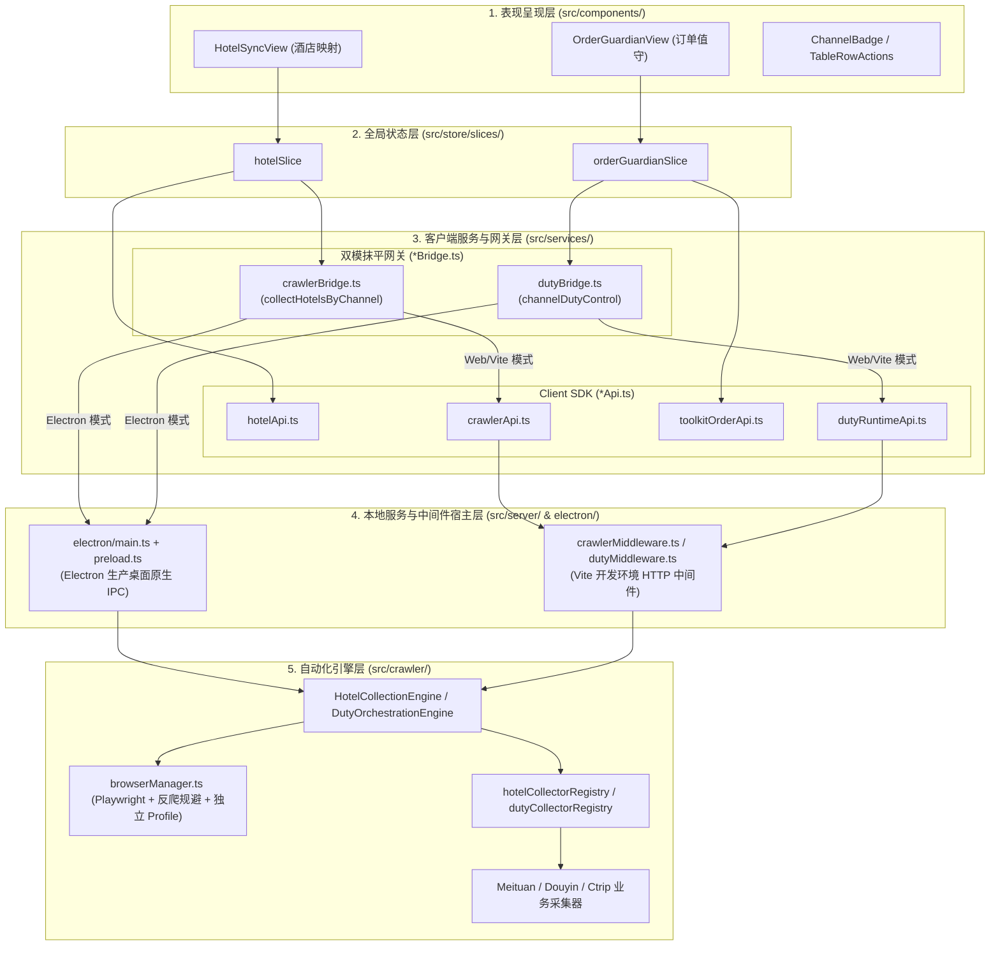

# 全栈统一采集与值守架构设计规范 (Unified Crawler & Duty Architecture)

> 文档状态：已确立并全面实施于 `feat/store-collection` 分支  
> 适用范围：所有涉及外部 OTA 渠道自动化（门店采集、商品采集、订单值守、会话维持）与文旅中台通信的模块

---

## 1. 架构定位与设计哲学

在企业级控制台应用中，既存在面向外部 SaaS/中台的标准化 HTTP 请求，又存在面向底层浏览器自动化（Playwright/CDP）的原生能力调度。
为彻底消除跨层认知混淆并恪守 **KISS 原则** 与 **AGENTS.md 刚性约束**，系统确立了**五层同心圆统一架构**：

---

## 2. 端层职责与文件命名刚性契约

为杜绝跨目录同名冲突（如 `server/crawlerApi.ts` vs `services/crawlerApi.ts`），分层命名后缀具有严格语义：

| 分层定位 | 目录路径 | 命名规范 | 职责边界 | 规范示例 |
| :--- | :--- | :--- | :--- | :--- |
| **客户端 SDK** | `src/services/` | `*Api.ts` | 承载向外部中台网络或本地 HTTP 网关的请求，直接返回 Promise 数据。 | `hotelApi.ts`, `toolkitOrderApi.ts`, `crawlerApi.ts` |
| **双模抹平网关** | `src/services/` | `*Bridge.ts` | 探测 `window.electron`，自动路由原生 IPC 或回退本地 HTTP，抹平端环境差异。 | `crawlerBridge.ts`, `dutyBridge.ts` |
| **本地服务中间件** | `src/server/` | `*Middleware.ts` | 承载 Vite 开发/预览服务器的 Node.js 中间件，直接调用内部引擎。 | `crawlerMiddleware.ts`, `dutyMiddleware.ts` |
| **原生宿主层** | `electron/` | `main.ts`, `preload.ts` | 桌面端主进程生命周期与安全上下文隔离注入。 | `ipcMain.handle('crawler:collect-hotels')` |
| **自动化引擎与采集器** | `src/crawler/` | `*Engine.ts`, `*Collector.ts` | 调度 Playwright、管理 CDP 会话、执行页面操作与数据清洗。 | `engine.ts`, `meituanCollector.ts` |

---

## 3. 核心设计规范

### 3.1 渠道身份标识全链路大写归一化 (`channelCode`)
- 历史代码中存在 `channelId` 与 `channelCode` 混用（如 `meituan` vs `MEITUAN`）。
- **统一准则**：系统全面废除松散的 `channelId`，全链路（UI、Store、Bridge、IPC、Collector）统一以**大写 `channelCode`** 作为唯一法定凭证：
  - 美团：`MEITUAN`
  - 美团商旅：`MEITUAN_BIZ`
  - 抖音：`DOUYIN`
  - 携程：`CTRIP`
  - 飞猪：`FLIGGY`
- 工具函数 `src/utils/channelMeta.ts` 集中提供渠道中文名称、徽章底色、简称等元数据，禁止在各业务视图分散硬编码。

### 3.2 浏览器会话管理与反爬规避 (`browserManager.ts`)
- **独立持久化 Profile**：按渠道隔离存储在 `.chrome-profile/<channelCode>`，确保各 OTA 平台登录态互不污染。
- **反爬指纹篡改 (Stealth)**：通过 `injectStealthScripts` 抹除 `navigator.webdriver`、伪造 Chrome 运行时与插件列表。
- **双模可视化体验**：
  - 默认以 **Headed (可视化窗口)** 运行，注入 AI Agent 风格的高亮操作轨迹与 HUD 悬浮指示器，提供绝对操作掌控感；
  - 仅在显式配置 `headless: true` 或 `PLAYWRIGHT_HEADLESS === 'true'` 时静默后台运行。

### 3.3 并发保护与 Fail-Fast 阻断
- 自动化引擎（`HotelCollectionEngine` 等）内部维护 `activeChannelJobs = new Set<string>()`。
- 当某一渠道正在采集或值守时，重复请求立即 Fail-Fast 抛出异常阻断，并在 UI 呈现人性化提示，杜绝并发竞争与脏数据。
