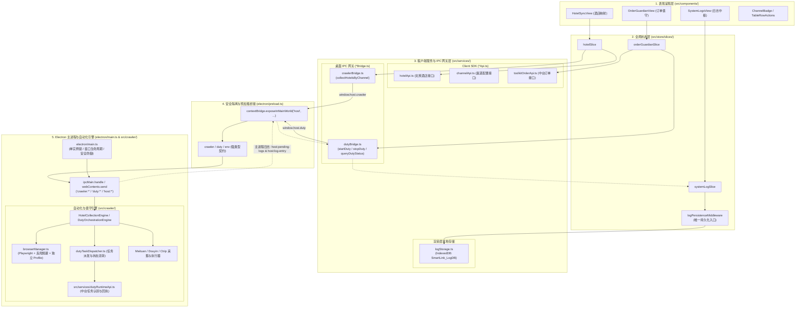

# 全栈统一采集与值守架构设计规范 (Unified Crawler & Duty Architecture)

> 文档状态：已确立并全面实施于 Electron-Only 架构基线
> 适用范围：所有涉及外部 OTA 渠道自动化（门店采集、商品采集、订单值守、会话维持）与文旅中台通信的模块

---

## 1. 架构定位与设计哲学

本系统定位为**纯正的跨平台桌面端控制台应用 (Electron-Only)**，全面废除任何形式的独立 Web 宿主与双模（Electron/Web）降级分支。
系统以“**职责严格隔离、直接优于抽象、零技术暴露**”为核心原则，确立了五层同心圆原生桌面架构：

---

## 2. 端层职责与文件命名刚性契约

为杜绝跨目录同名冲突与职责混淆，各分层命名后缀具有严格的语义约束：

| 分层定位 | 目录路径 | 命名规范 | 职责边界 | 规范示例 |
| :--- | :--- | :--- | :--- | :--- |
| **客户端 SDK** | `src/services/` | `*Api.ts` | 承载渲染层向外部文旅中台网络的异步请求，返回 Promise 数据。 | `hotelApi.ts`, `channelApi.ts`, `toolkitOrderApi.ts` |
| **桌面 IPC 网关** | `src/services/` | `*Bridge.ts` | 封装 `window.host`，提供强类型 IPC 调用，Electron 环境缺失时立即 Fail-Fast 阻断。 | `crawlerBridge.ts`, `dutyBridge.ts` |
| **预加载脚本** | `electron/` | `preload.ts` | 通过 `contextBridge.exposeInMainWorld('host', ...)` 安全注入白名单 API，杜绝 Node 原生对象泄露。 | `preload.ts` |
| **主进程宿主** | `electron/` | `main.ts` | 负责应用单实例锁、生命周期调度、窗口安全策略与原生 IPC 监听器注册。 | `main.ts` |
| **自动化引擎与采集器** | `src/crawler/` | `*Engine.ts`, `*Collector.ts`, `*Runner.ts` | 运行于主进程，负责 Playwright 驱动、会话维持、任务认领与执行回执。 | `engine.ts`, `dutyOrchestrationEngine.ts`, `meituanDutyRunner.ts` |
| **持久化与日志中间件** | `src/store/`, `src/services/` | `*Middleware.ts`, `*Storage.ts` | 统一管理 Redux 日志流与 IndexedDB (`SmartLink_LogDB`) 唯一持久化落库。 | `logPersistenceMiddleware.ts`, `logStorage.ts` |

---

## 3. 核心设计规范与机制

### 3.1 渠道身份标识全链路大写归一化 (`channelCode`)
- 全链路（UI、Store、Bridge、IPC、Runner、Collector）统一以**大写 `channelCode`** 作为唯一法定凭证：
  - 美团酒店：`MEITUAN`
  - 美团商旅：`MEITUAN_BIZ`
  - 抖音生活服务：`DOUYIN`
  - 携程：`CTRIP`
  - 飞猪：`FLIGGY`
  - 同程：`TONGCHENG`
  - 去哪儿：`QUNAR`
  - 小红书：`RED`
- 元数据统一由 `src/utils/channelMeta.ts` 集中管理，严禁在业务组件中分散硬编码。

### 3.2 唯一日志数据源流水线 (Single Source of Truth for Logs)
1. **单一数据源边界**：Electron 渲染进程的 IndexedDB（库名 `SmartLink_LogDB`）是全系统**唯一**的日志持久化存储。
2. **主进程日志回流机制**：
   - 主进程生命周期与调度异常通过 `publishMainLog` 暂存至环形缓冲区（上限 50 条）；
   - 渲染层挂载时通过 `logBridge.takePendingHostLogs()` 一次性取回冷启动日志；
   - 运行期间通过 IPC 事件 `'host:log-entry'` 实时推送至渲染进程；
   - 渲染进程统一 dispatch `addLog` / `addLogs`，经由 `logPersistenceMiddleware` 幂等落库，彻底消除“界面可见重启丢失”与“主进程日志黑洞”。

### 3.3 浏览器会话管理与反爬规避 (`browserManager.ts`)
- **独立持久化 Profile**：按渠道隔离存储在 `~/.../profiles/<channelCode>`，杜绝各 OTA 平台登录态与 Cookie 互串。
- **物理锁清理防护**：启动前与关闭后自动清理 `SingletonLock`、`SingletonSocket` 等锁文件，杜绝崩溃残留引发的 `Profile in use` 异常。
- **反爬规避 (Stealth)**：通过 `injectStealthScripts` 抹除 `navigator.webdriver` 等自动化特征。
- **可视化操作与 HUD**：默认以可视化窗口 (Headed) 启动，并注入大模型操作风格的视觉跟踪与状态 HUD，保障操作透明可控。

### 3.4 桌面端安全纵深防御
1. **沙箱与隔离**：严格开启 `contextIsolation: true`、`sandbox: true`、`nodeIntegration: false`。
2. **内容安全策略 (CSP)**：通过 `index.html` 限制仅允许本地脚本与受信任字体/连接。
3. **导航拦截保护**：主进程监听 `will-navigate`，非白名单或非本地构建主页的跳转一律拦截，防止拖拽文件或恶意重定向导致界面状态丢失。
4. **外链与权限**：新窗口统一由系统默认浏览器打开 (`shell.openExternal`)，静默拒绝所有未授权原生系统权限。
